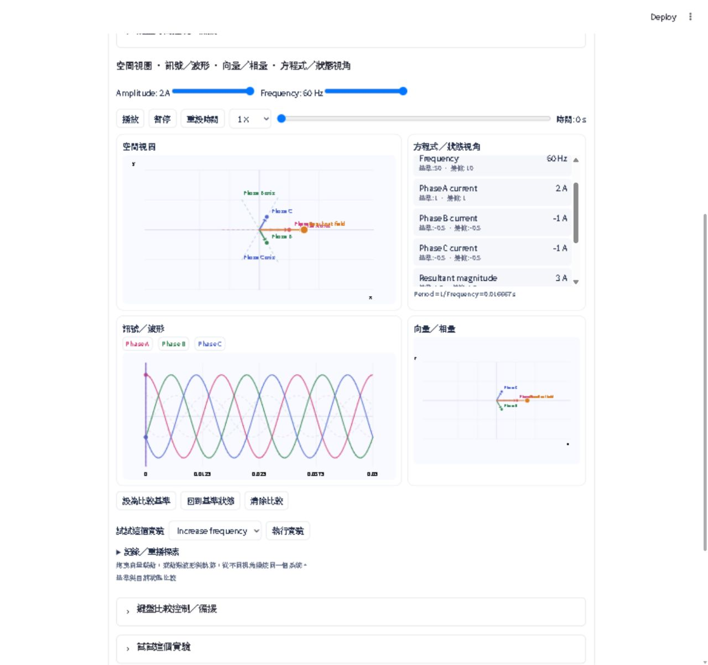
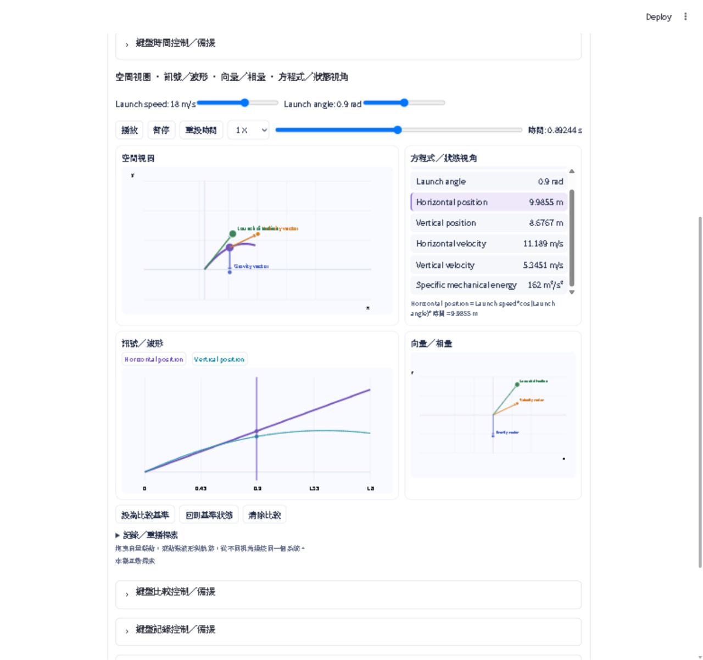

# Day 18 implementation and acceptance evidence

Status: implemented and verified offline; **human real-PDF/model acceptance remains pending**. No commit or push. No production dependency added. Existing Day 17 changes in the working tree were preserved.

Follow-up: the initial live compiler failure was subsequently reproduced with the user's exact public three-phase text and corrected in schema 2.1. Real Responses output now passes the normalizer and normal app runtime integration tests. See [DAY18_COMPILER_FIX.md](DAY18_COMPILER_FIX.md) for the newer evidence and test counts. The original results below are retained as development history, not current final counts.

## Architecture after repository inspection

Day 18 extends the existing Learning Scene boundary, not Dynamic Simulation:

`normal analysis result → explicit domain CTA → scene/compiler.py → scene/validator.py → scene/state.py → scene/runtime.py`

The existing compiler's bounded source/analysis context, explicit request discipline, material/language cache identity, source-page whitelist and optional-feature isolation are reused. The probability domain and its finite-set evaluator remain intact. The normal result path renders the spatial CTA/workspace before the older learning overview; the badge is Day 18 / 30. Relationships remain secondary/collapsed for scene-suitable material.

The main analysis supplies a small suitability/domain declaration. Conservative source-backed detection also supports older analyses. A spatial build sends a strict `spatial_dynamics` version 2.0 declaration through the same compiler, using existing extracted source/analysis and bounded lab equations, without resending the PDF. Invalid returned specs are cached; transient request failures remain explicitly retryable. Time, parameters, focus and recording state do not enter the compiler cache identity.

Domain-specific assumptions that required generalization were the probability-only schema/domain/version cache identity, the runtime's probability dispatch, and probability `focus_targets` assumptions when saving state. Numeric physics is not forced through the set-expression engine. `scene/world/` adds a bounded safe-math quantity DAG, shared projections, validated forward/inverse bindings, sampled invariants and atomic semantic patches.

Each renderer consumes projected values from the same quantity evaluation. It does not define its own physics. Moving vector origins are quantity bindings too: the projectile velocity vector is attached to the moving body's position. There is no motor-specific or projectile-specific renderer branch.

The contained offline frontend receives numbers and labels, never executable model expressions. One browser clock updates spatial, waveform, vector-plane and equation/state views. Python retains the last committed mirror, not a competing view clock. Primary controls send the visible time and the semantic change together. Scene fingerprint, revision and token checks reject stale/duplicate messages. Invalid current-scene gestures acknowledge a safe revision without changing physical state, allowing the client to recover. No per-frame Streamlit rerun or OpenAI request occurs.

## Architecture Stress-Test Results

| Evidence | Result |
| --- | --- |
| Coordinated renderer/view types | 4: spatial, waveform, vector-plane, equation/state |
| Additional fallback | 1 camera-enabled Plotly planar 3D snapshot, explicitly z = 0 |
| Spatial primitive types | 4: point, vector, trajectory, reference axis |
| Semantic binding types | 7: 4 forward + 3 inverse |
| Forward binding instances tested | 28: three-phase 16 + projectile 12 |
| Inverse binding instances tested | 3: three-phase 1 + projectile 2 |
| Inverse types tested | angle-to-time, angle-to-parameter, nearest sampled trajectory time |
| Invariant types tested | All 6: approx_equal, bounded, constant_over_time, vector_relation, phase_difference, sum_relation |
| Declared fixture invariants | 9: three-phase 7 + projectile 2 |
| Fixture validation comparisons | 3,888: 3,024 + 864; each scene uses 9 parameter scenarios and 48 samples per invariant |
| Invalid/malicious spec cases | 54 named cases, each rejected by both normalization and the optional-scene boundary (108 rejection invocations) |
| Cross-domain fixtures | 2 passed, rendered by the same production runtime |
| Final focused Day 18 tests | 33 passed in 26.469 s |
| Preserved Day 17 tests | 19 passed; also included in the final full suite |
| Final full regression | 105 passed in 95.658 s; no skips |

Forward types are `vector_components`, `point_position`, `curve_value`, and `metric_value`. Inverse types are `angle_to_time`, `angle_to_parameter`, and `nearest_path_time`. Inverses are whitelisted analytic/discrete mappings, not a general solver. Angle-to-time chooses the nearest legal cycle using the current visible time.

The balanced three-phase fixture verifies 120-degree spatial axes and waveform offsets, `Ia + Ib + Ic ≈ 0`, component/vector-sum agreement and resultant magnitude `1.5 × amplitude` across the sampled range. The projectile fixture verifies its common position/velocity graph projections, moving vector origin, launch-angle/path inverses and conserved specific mechanical energy for its ideal no-loss model.

The security cases include unknown/huge primitives and frames; duplicate/reserved IDs; unsupported calls, attributes, indexing, long expressions and arbitrary names; non-finite division and absurd coordinates; illegal parameter/time bounds; missing, cyclic or contradictory bindings; broken semantic references; invalid/false invariants; excessive samples; invalid inverse references/geometry; and unsupported or excessive experiment patches. Separate tests reject malformed recordings, unknown replay IDs, out-of-range state patches and unsafe unsampled local states while preserving the accepted world.

### Measured bounded computation

Measured locally with Python 3.14 using `python -B -m tests.world_metrics`. Frame generation is the median of five runs; payload measurement includes preparation/serialization. These are not browser FPS measurements.

| Fixture | Frames / objects | Validation | Frame generation | Payload preparation | Payload bytes |
| --- | --- | --- | --- | --- | --- |
| Three-phase | 120 / 7 | 175.54 ms | 3.19 ms | 17.32 ms | 115,570 |
| Projectile | 120 / 5 | 37.32 ms | 1.52 ms | 5.79 ms | 67,762 |

Bounds: 12 objects, 8 vectors, 6 waveform series, 24 quantities, 4 parameters, 20–180 frames, 32 forward bindings, 4 inverse bindings, 12 invariants with 3–64 samples, 4 experiments with 8 steps each, and 80 recorded steps. Numeric caches retain four parameter states; workspace/replay payload is limited to 2 MiB and deduplicates repeated frame tables. The existing safe evaluator's AST/function/numeric limits remain enforced; each expression references at most five variables.

### Hardest problem, actual mistakes and corrections

The hardest issue was synchronizing a responsive browser clock with Streamlit's committed session state without per-frame app reruns. An initial design placed primary parameter/comparison/recipe controls outside the contained runtime. Review showed that actions during playback would operate on old committed time. Primary controls were moved into the runtime and now send atomic active-time semantic actions. Keyboard fallbacks remain explicitly committed-state controls. Regression tests cover active-time parameter, focus, baseline, inverse and recording ingress.

Actual failures and review findings:

- The first real browser render was blank: a top-level helper named `location` collided with `window.location`. Renaming it fixed the startup error; the frontend smoke test guards against its return.
- Browser gestures initially failed to reach Python because the Streamlit component message omitted `dataType: "json"`. The protocol and smoke test were corrected.
- A frontend smoke test exposed replay-generation reuse across different scenes. Replay identity now includes the scene fingerprint.
- Review found duplicate layout renders could reset the local clock. Identical scene/revision/labels/replay-generation renders are now idempotent; a smoke regression verifies this. This was a review finding, not a separately proven sole cause of an observed browser failure.
- The initial fixed-origin assumption could not represent the projectile velocity attached to a moving body. `origin_quantity_ids` generalized that binding rather than adding projectile renderer code.
- Mathematical tests alone did not catch unequal x/y display scales distorting 120-degree geometry. Browser/review QA led to equal physical spatial scales and letterbox-aware pointer coordinates.
- An invalid gesture could leave the frontend waiting indefinitely. Safe rejection acknowledgement advances protocol metadata only; an AppTest verifies recovery with the physical state unchanged.
- Windows frontend-test diagnostics initially failed cp950 decoding; the test subprocess now uses UTF-8. A module-style invocation also exposed the older tests' top-level fixture imports; subsequent runs used the repository's normal discovery command, and the new fixtures support both invocation styles.

No false story of a failed physics fixture is claimed: the legitimate three-phase and projectile math passed their first focused run. Browser testing used the computer-use skill and directly exposed frontend integration errors that pure Python tests missed.

### Unfinished / explicit limits

All Ultra feature categories have working bounded offline implementations. This is not a claim of accepted Day 18 product quality:

- Real OpenAI spatial compilation and fidelity to an actual physics PDF have **not** been run in this pass. AppTest uses strict mock Responses output. Source correctness and generation quality require human acceptance.
- Spatial state is planar x/y, not volumetric 3D. The optional z=0 Plotly camera view is a static committed-state fallback and is not synchronized browser playback.
- Only three safe inverse types are supported; no magnitude inverse, general constraint solver, arbitrary geometry or field mesh.
- Invariant sampling is bounded numerical evidence, not a continuous proof or independent verification of source physics. Actual local states are validated again.
- Recordings are bounded semantic sequences in session memory, not exports, persistent teacher recordings or screen captures. Browser replay endpoint/control recovery was checked; detailed intermediate replay fidelity remains part of human acceptance.
- Keyboard fallbacks use the committed mirror; pause primary playback first. Generated fixture labels are English because the offline fixtures explicitly store English analysis language; product chrome is localized. A real Traditional Chinese compilation is still required to judge generated labels.
- No 60 FPS promise, mobile/browser matrix, Community Cloud deployment or real-PDF upload acceptance is claimed.

## Automated and browser evidence

The integration tests run the repository-root `app.py` with a realistic quantitative PDF analysis/source context seeded into its normal result branch. They verify the localized spatial section and CTA appear before the old overview, build uses one targeted strict request, all coordinated view headings render, cached reopen is local, new material resets stale state, local actions preserve request count, browser inverse messages reach canonical state, and malformed worlds do not break prior features. The tests do not pretend to upload a real PDF or call the real model.

Final commands (from the repository root):

```powershell
python -B -m unittest discover -s tests -p 'test_day18.py' -q
python -B -m unittest discover -s tests -q
```

The optional Node frontend smoke runs inside the focused suite here and was not skipped. Production needs no Node runtime. An earlier full run passed 102 tests before the last shared-clock/rejection-recovery review. Those real corrections added three tests; the focused 33-test run and the final 105-test full run followed. The full rerun was necessary after a substantive fix, not an unchanged repeated run.

Real browser checks used the offline acceptance entry point and the production scene runtime. Both systems visibly showed all four views. Three-phase playback, pause, vector/focus changes, resultant-angle drag, amplitude/baseline ghosts and a frequency experiment were exercised. The projectile waveform click synchronized time/position/velocity/equations. Recording captured time, parameter and focus changes; replay returned the recorded endpoint with controls enabled. This pass does not substitute offline fixtures for model-generated product acceptance.





## Files and dependencies

Created:

- `scene/world/__init__.py`, `schema.py`, `engine.py`, `validator.py`, `state.py`, `runtime.py`, `frontend/index.html`
- `tests/world_fixtures.py`, `test_day18.py`, `world_frontend_smoke.cjs`, `manual_day18.py`, `world_metrics.py`
- `docs/DAY18_EVIDENCE.md`, `day18-three-phase-browser.png`, `day18-projectile-browser.png`

Modified for Day 18:

- `app.py`, `i18n.py`, `presentation.py`
- `scene/compiler.py`, `schema.py`, `state.py`, `validator.py`, `runtime.py`
- `tests/test_day17.py` (badge assertion now Day 18; the 19 Day 17 tests remain)
- `README.md`, `PRODUCT_VISION.md`, `AGENTS.md`

Some of these files already contained the user's uncommitted Day 17 edits. Their existing work was preserved. Pre-existing changes in `scene/expressions.py`, `scene/renderers.py`, `tests/scene_fixtures.py`, `tests/support.py` and tracked bytecode are not credited as Day 18 implementation. No new dependency and no secrets changes.

## Exact human live-test steps

1. Restart the production process from this checkout: `python -m streamlit run app.py`. Verify **Day 18 / 30**, Traditional Chinese UI and pasted text still work.
2. Upload/reanalyze a real quantitative three-phase PDF. Before the normal overview, find **空間學習場景** and **建立空間學習場景**. Do not use Day 16's dynamic-simulation button.
3. Build once. Verify real compiler/validator success and a source-faithful spatial, three-waveform, vector and equation/state workspace. If rejected, retain the safe error and inspect the generated model rather than weakening validation.
4. Scrub time, click waveform time, select a phase and rotate the resultant endpoint. Confirm cursor, phase currents, contribution vectors, resultant and state values agree. Drag should preserve the nearest valid electrical cycle.
5. While playing, change amplitude/frequency and set a baseline. Confirm the action uses the currently visible time; baseline ghosts/deltas remain fixed and all current views update. Reset/clear comparison. Check Pause/reset/speed without app-wide frame flashing.
6. Run a source-supported recipe. Start recording; change time, parameter and focus; stop; replay; pause midway and replay again. Check sequence and endpoint, not just the recording count. None of these actions should request OpenAI or rebuild the scene.
7. For deterministic cross-domain acceptance, run `python -B -m streamlit run tests/manual_day18.py`. Choose **Projectile motion**; scrub/click trajectory, adjust launch-vector angle, inspect moving velocity origin and compare a baseline. Both fixtures use the same runtime. Also test a real projectile PDF in production if available.
8. Select a quantity with a source page and open existing Source Lens. Check the smallest defensible page set and source/model assumptions. Switch UI language without recompilation; existing generated content must retain its analysis language.
9. Reopen the cached scene, then analyze new material and verify stale world/recording state resets. Recheck the Day 17 probability PDF, probability views and local selection, plus Day 15 lab and Day 16 simulation. Relationships/source/Explain This should remain secondary.

Human acceptance decides whether the learner visibly perceives one physical system manipulated from multiple directions. Passing offline safety and synchronization tests alone is not the completion criterion.
