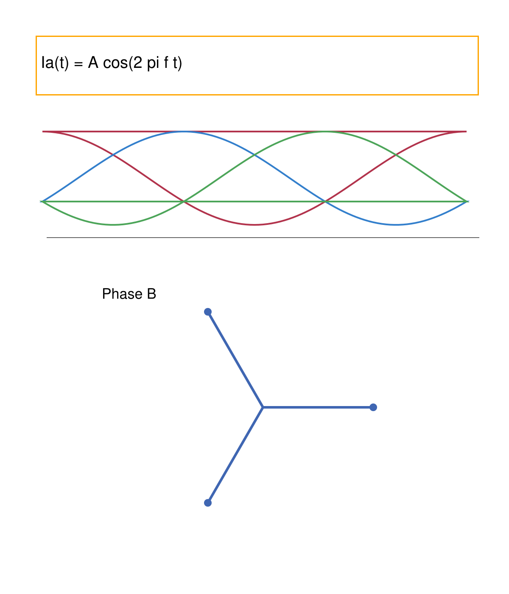
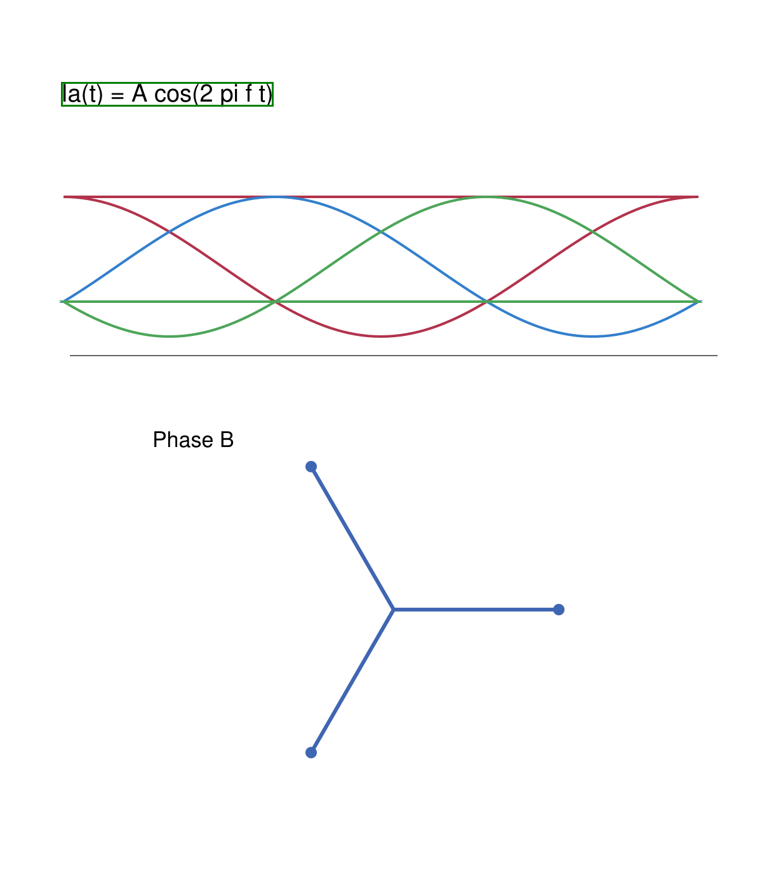

# Day 20 — research, reuse and native document geometry

Date: 2026-10-02. Human live acceptance pending. No commit/push or paid OpenAI requests in this sprint. AppTest compiler calls are mocks. The pre-existing dirty Day 18/19 implementation and earlier user changes were preserved; this report describes only Day 20 work.

Subsequent real-PDF integration debugging is documented in [DAY20_NATIVE_TEXT_FIX.md](DAY20_NATIVE_TEXT_FIX.md); test counts below describe the original sprint, not the later fix.

## Research and decision

Read repository/git status, AGENTS, PRODUCT_VISION, existing scene/world and Source Atlas paths before choosing an integration. The [landscape](OPEN_SOURCE_LANDSCAPE.md) contains comparisons, architectural recommendations, close competitors, reuse scorecard and Day 21–30 roadmap. The [ledger](OPEN_SOURCE_REUSE_LEDGER.md) has 30 candidate/existing-component entries with upstream URLs, license qualifications and decisions. Research covered document parsers, provenance/knowledge graphs/RAG, learning systems and renderers, beyond the original seed projects.

Only **pdfplumber 0.11.10** was newly installed and exercised locally. Other candidates were evaluated through primary repository/docs/license evidence, not runtime benchmarks. Existing pypdf, PyMuPDF, Plotly and Streamlit are exercised by fixtures/tests. Docling remains an offline comparison candidate; MinerU's current custom license/commercial thresholds and models are not imported; Marker code and weights have separate terms; AGPL LearnHouse is UX research only. A RAGFlow server and generated executable HTML runtime were deferred because they impose a different deployment/execution model. Augmented Physics, ViviDoc, AlgeBench and Docling Graph demonstrate real overlap: do not claim source-linked interactive documents or graph provenance alone are new.

Stop rebuilding PDF geometry, generic graph layout, RAG/document chat, OCR and rendering engines. Keep building and validating the source-to-semantic-to-shared-state connection contract; this is a product hypothesis, not proven exclusivity or learning efficacy.

## Actual product change

An explicit, secondary local action appears inside the existing Source Atlas builder. A pdfplumber public-API adapter extracts native text geometry and passes it through a parser-neutral PDF-hashed envelope and existing Atlas region validator. Stable page/line locators remain separate from semantic IDs. Native regions have no semantic links and do not own focus. The original fixed Atlas renderer displays the preview even with no Learning Scene. A subsequent explicit semantic Atlas build uses bounded native text/box hints; a unique exact whole-line match can refine a formula/label box while preserving confidence and all semantic links. Ambiguous/partial/low-confidence matches and vector boxes are unchanged.

No new scene subsystem, main analysis schema, generated code execution or per-interaction API request. The local preview does not mark semantic compilation as attempted. Existing reducer/world focus and PDF page renderer are reused. Failures/missing dependency leave the original path available; successful parser caches hold at most two models and exclude time/parameters/focus.

Bounds: 20 MiB PDF, three analyzed pages, 20,000 native characters/page, 24 text regions/page, 64 total, 600 characters/line, 256 KiB normalized payload, finite/nontrivial boxes, canonical supported page frame. Native extraction is not OCR, diagram/table classification, math understanding or validated semantic reading order. Dense pages above 24 extracted lines are declined rather than silently truncated. Nonzero MediaBox origins and invalid frames are declined. A hostile PDF can still consume resources during library parsing before output bounds: process-level timeout/RSS isolation is future work, not implemented security.

## Bugs and assumptions actually exposed

- First raster test assumed more than 30 ink pixels for every rotated label. A narrow one-character B does not satisfy that assumption; the check now requires actual dark pixels and a minimum ink fraction. This was a test assumption, not a production fix.
- Next raster test found a real 180-degree asymmetric CropBox error: a naive crop-box axis swap yielded a region containing no text pixels. The adapter now derives the visible frame from formal MediaBox/CropBox/Rotate, with reflections at 180/270 degrees. All four rotations and unequal page sizes have raster-ink regressions. Unsupported frames fail safely rather than guessing coordinates.
- No real user 7-page notes/slides/handwritten PDFs were available in the repository corpus. Synthetic cases are explicitly labeled and cannot establish real-document accuracy. No failure story or benchmark for uninstalled parsers is invented.

## Tests

Focused command:

```powershell
python -B -m unittest tests.test_day20 tests.test_day19 tests.test_day19_optional_scene -q
```

**59 passed in 21.962 s**: 20 Day 20 tests plus 39 Source Atlas regressions, no skips. [Focused log](day20-focused.log).

New coverage: actual parser/locators, hash/page identity, envelope metadata, non-finite/degenerate boxes, types/semantic/code-shaped text rejection, duplicate identities/locators, PDF/region/payload bounds, native uncertainty, exact-match refinement and ambiguous/low/partial fallback, bounded compiler hints, image-only failure, cross-domain fixtures, crop/rotation raster checks and unsupported frame rejection, cache identity/bounds, no-scene normal-PDF preview, missing dependency, parser failure preserving the world, and native preview → explicit semantic Atlas → world focus with request counts.

Final full command: `python -B -m unittest discover -s tests -q`. **202 passed in 133.894 s**, no skips or failures, run once after stabilization. [Regression log](day20-final-regression.log). Existing Streamlit bare-context/deprecation warnings remain; the parser-failure warning is deliberately exercised by an isolation test. Browser SVG gestures and real model grounding remain separate human acceptance, not AppTest claims.

## Reproducible benchmark (not accuracy)

Run `python -B tests/benchmark_day20.py`. [JSON results](day20-benchmark.json), [terminal evidence](day20-benchmark.log), inspectable in-memory corpus generator in `tests/day20_fixtures.py`. Warm timing is the median of three iterations with tracemalloc enabled, on this Windows/Python 3.14.7 machine. Allocation peak is Python-tracked allocation, not process RSS/native memory. Cold first parse: **153.824 ms**. This compares pypdf text-only extraction with the optional geometry supplement, not whole-app latency or competing model parsers.

| Synthetic case | Text-only ms | Geometry ms | Native text regions after |
|---|---:|---:|---:|
| Lecture/phasor, unequal pages | 34.926 | 82.936 | 3 |
| Projectile | 18.477 | 44.774 | 3 |
| Probability | 6.611 | 42.547 | 4 |
| Formula-heavy | 15.298 | 74.626 | 12 |
| Image-only | 4.421 | 20.881 | 0 |
| Messy vector marks plus formula | 9.629 | 26.901 | 1 |
| Crop + 90-degree rotation | 35.861 | 80.898 | 10 |

The before text-only path exposes zero native geometry regions; this does **not** mean the existing AI Atlas had zero regions. The new path is slower but supplies deterministic text coordinates. Python peak allocation ranges: before 207,657–3,857,145 bytes, after 808,649–5,115,191 bytes. The image-only and messy vector cases show the capability boundary. Messy marks are not authentic handwriting; no handwriting/OCR claim.

The same formula's normalized box area changes **0.087 → 0.007571545238095237**, with unchanged semantic confidence. This is area/geometry evidence, **not 91% accuracy improvement**. Orange before and green after overlays were visually inspected against the same raster; the formula box encloses the original text and the rest of the page is unchanged:




Malformed PDF and a 25-line native page both decline safely. Real PDF language/font/layout cases still require testing. No credible semantic accuracy/error rate can be reported without an annotated real corpus.

## Dependencies and attribution

Base `requirements.txt` unchanged. Optional `requirements-documents.txt` pins pdfplumber 0.11.10. Newly installed transitives: pdfminer.six 20260107, pypdfium2 5.13.0, cryptography 50.0.2, cffi 2.1.1 and pycparser 3.0. No weights/models, mandatory cloud dependency, package removal or vendored upstream code. These six installed distributions total 31,252,654 file bytes (~29.8 MiB) here, not deployment image size; wheel download evidence is in [install log](day20-parser-install.log). Existing Pillow/charset-normalizer were reused.

[THIRD_PARTY_NOTICES](../THIRD_PARTY_NOTICES.md) preserves the pdfplumber MIT notice and records transitive license/notice paths. Retain MIT/BSD/Apache notices and applicable PDFium bundled third-party notices when redistributing. No code/assets were copied from learning competitors. Existing PyMuPDF AGPL/commercial licensing is still a deployment audit item; adding MIT pdfplumber does not settle it. See ledger for per-package/model/path caveats.

## Day 20 files

- New production: `document_intelligence/__init__.py`, `model.py`, `pdfplumber_adapter.py`, `service.py`, `ui.py`; optional requirements and third-party notices.
- Scoped changes: `source_atlas/compiler.py` (local CTA/context/refinement), `source_atlas/runtime.py` (native provenance/text), `i18n.py` (labels), `presentation.py` (Day 20 badge). No Day 20 app.py rewrite.
- New tests/tools: `tests/test_day20.py`, `tests/day20_fixtures.py`, `tests/benchmark_day20.py`. Day 17/18/19 test badge expectations updated only.
- Documentation: README, PRODUCT_VISION, AGENTS prior-art/adapter rules, landscape, reuse ledger, this report and generated test/benchmark/install logs and overlays. Other dirty Day 18/19 files predate this sprint and were not reset.

## Exact human live-test steps

1. In the project environment, `python -m pip install -r requirements-documents.txt`, then `python -m streamlit run app.py --server.port 8521`. If a server already occupies 8521, restart that existing app yourself rather than start another process. Default language is Traditional Chinese.
2. Upload a real text-based PDF and analyze normally. Before building a scene, open Source Atlas and select 1–3 analyzed pages with native formulas/labels. Click **本機解析文件結構**. Verify original pages and native text regions appear with no semantic-scene requirement and no new OpenAI request.
3. Select a text region; compare its box and plain source excerpt with the original PDF. Try a cropped/rotated page, then a dense page: the latter may deliberately fall back with a subtle message, leaving analysis and source viewing intact.
4. Explicitly build a probability/spatial scene as usual and **建立來源互動圖譜**. This normal user acceptance step can incur existing app API costs; it was not performed in the research sprint. Verify source↔scene focus, page navigation and formula trace retain canonical state. Only unique exact formula/label line matches receive native geometry; vectors/uncertain regions must not acquire invented boxes.
5. Change time/amplitude/frequency, select events/outcomes, navigate lessons/review and change source filters/zoom. Verify local state and existing caches remain, and no compilation request occurs for these interactions. Check English labels as well.
6. Test the base environment without optional pdfplumber: only the local parsing action should be unavailable; original AI Atlas/Source Lens/learning scenes must remain usable. AppTest already covers this without uninstalling the user's package.

Article evidence: show the landscape/license decision tables (including rejected MinerU/AGPL or generated-code paths), optional dependency diff, 59-test focused terminal result, final full result, benchmark rows with honest caveats, and before/after formula overlays. Capture a real app screenshot of native preview before scene compilation and another of source↔scene focus during human acceptance. Do not label these offline overlays as browser screenshots or paid live model evidence.
